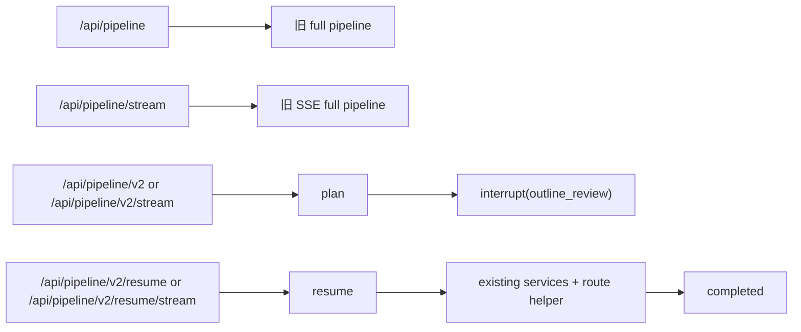

# 智能写作助手（Intelligent Writing Assistant）

基于 [Hello-Agents](https://github.com/jjyaoao/HelloAgents.git) 的多 Agent 写作系统，提供从规划到改写的完整链路，并集成 RAG、引用约束、会话记忆与 LangGraph v2 interrupt / resume 演示闭环。

## 1. 关键能力

- 多 Agent 写作流水线：`plan -> draft -> review -> rewrite -> citations`
- 流式生成：支持分步与一键 Pipeline 的 SSE 实时状态与结果推送
- RAG 检索增强：支持 `.txt / .pdf / .docx / .md / .markdown` 上传与检索
- 调用模式三态：`RAG-only / Hybrid / Creative`
- 记忆机制：会话隔离（`session_id`）、历史压缩、冷存写入与冷存召回回注
- 外部知识接入：GitHub MCP（可选）及显式工具 API
- LangGraph v2 最小接入：
  - `plan`
  - `outline` 后 interrupt
  - 基于 `thread_id` 的 checkpoint / resume
  - resume 后继续复用现有后半段 service
- 前端 Workspace 已支持 LangGraph v2 演示闭环：
  - interrupt / outline review / resume
  - 同步与流式两种 v2 路径
  - 子阶段进度条展示（生成大纲 → 等待人工修订 → 收集研究笔记 → 创作初稿 → 审阅反馈 → 修改润色 → 生成引用）

## 2. 技术栈

- 后端：FastAPI、Uvicorn、Hello-Agents、LangGraph
- 存储：SQLite（结构化、历史与 v2 checkpoint）、Qdrant（向量检索，可选）
- 前端：Vue 3、TypeScript、Vite、Pinia
- 检索增强：HyDE、Rerank、中文分词（jieba）

## 3. 项目结构（简版）

```text
my_agent/
├── backend/
│   ├── app/
│   │   ├── agents/      # Writing / Reviewer / Editor
│   │   ├── api/routes/  # writing / pipeline / pipeline_v2 / rag / versions / settings / mcp_github
│   │   ├── services/    # pipeline, rag, citation, retrieval_eval, langgraph_v2...
│   │   ├── models/
│   │   └── config.py
│   ├── main.py
│   ├── .env.example
│   └── README.md
└── frontend/
    ├── src/views/        # Workspace / History / RagCenter / Settings
    ├── src/components/   # 编辑器、差异视图、进度条、评测组件等
    └── src/services/     # API 调用层
```

## 4. 快速启动

### 后端

```bash
cd backend
python -m venv venv
venv\Scripts\activate
pip install -r requirements.txt
copy .env.example .env
python main.py
```

后端地址：`http://localhost:8000`

### 前端

```bash
cd frontend
npm install
npm run dev
```

前端地址：`http://localhost:5173`

## 5. 关键 API

- 写作分步：`POST /api/plan`、`/api/draft`、`/api/review`、`/api/rewrite`
- 流式分步：`POST /api/draft/stream`、`/api/review/stream`、`/api/rewrite/stream`
- 一键流程：`POST /api/pipeline`、`POST /api/pipeline/stream`
- LangGraph v2：
  - `POST /api/pipeline/v2`
  - `POST /api/pipeline/v2/resume`
  - `POST /api/pipeline/v2/stream`
  - `POST /api/pipeline/v2/resume/stream`
- RAG：`/api/rag/upload`、`/api/rag/upload-file`、`/api/rag/search`
- 设置：`/api/settings/generation-mode`、`/api/settings/session-memory/clear`

接口文档：
- `http://localhost:8000/docs`
- `http://localhost:8000/redoc`

## 6. LangGraph v2 功能与逻辑链条

`/api/pipeline/v2` 不是对旧 Pipeline 的重写，而是在现有后端外层增加的一条最小控制流入口，用来验证 LangGraph 的 interrupt / resume 能力，同时不影响旧 `/api/pipeline` 与 `/api/pipeline/stream`。

### v1 / v2 区别

| 路径 | 控制流 | 中断能力 | 恢复能力 | 当前用途 |
|---|---|---|---|---|
| `/api/pipeline` | 旧同步全链路 | 无 | 无 | 生产主链路 |
| `/api/pipeline/stream` | 旧 SSE 全链路 | 无 | 无 | 生产流式主链路 |
| `/api/pipeline/v2` | LangGraph 最小工作流（同步） | 大纲后 interrupt | 通过 `/api/pipeline/v2/resume` | LangGraph 接入验证 |
| `/api/pipeline/v2/stream` | LangGraph 最小工作流（SSE） | 大纲后 interrupt | 通过 `/api/pipeline/v2/resume/stream` | LangGraph 流式演示 |

### 当前 v2 只做什么

- `plan`
- `outline` 生成后 interrupt
- `resume`
- resume 后继续复用现有 `collect_research_notes(...)`、`drafter.run_full(...)` 和现有 route helper

### 逻辑链条



### 当前限制

- 只有一个 interrupt 点：大纲生成后
- v2 重点是最小可恢复闭环，不是完整的 LangGraph 控制台
- 详细接口、checkpoint 存储与流式调用示例见 `backend/README.md`

## 7. 更新日志

<details>
<summary><strong>v0.5.6 (2026-03-19)</strong> — LangGraph v2 可恢复演示闭环增强</summary>

- ✨ 新增 LangGraph v2 持久化 checkpoint，`thread_id` 在服务重启后仍可 resume
- ✨ 新增 LangGraph v2 SSE 路径：`/api/pipeline/v2/stream`、`/api/pipeline/v2/resume/stream`
- ✨ 前端 Workspace 新增 LangGraph v2 最小演示闭环：interrupt → 大纲修订 → resume → completed
- ✨ 前端 v2 演示新增子阶段进度条：`生成大纲 → 等待人工修订 → 收集研究笔记 → 创作初稿 → 审阅反馈 → 修改润色 → 生成引用`
- 🔧 修复 plan 阶段大纲被 GitHub / 工具诊断文本污染的问题，planner 现在会过滤工具执行说明并正确解析 `### 1) Outline` 这类标题
- 🔧 v2 演示状态与旧 pipeline UI 状态隔离，避免 loading / step 状态互相污染

</details>

<details>
<summary><strong>v0.5.5 (2026-02-25)</strong> — 评测稳定性与线上检索策略路由增强</summary>

- ✨ baseline 脚本新增 `--repeats N`，支持重复运行并在报告中输出均值/标准差（Mean ± Std）
- ✨ baseline 报告新增 Agent 行为回归小套件（引用/拒答/模式切换/推断标注）规则判定区块
- ✨ 新增线上动态检索策略路由开关 `RAG_QUERY_STRATEGY_ROUTING_ENABLED`（按 query 类型切换 `dense_only / rerank / hyde / bilingual`）
- 🔧 修复 Hybrid 模式短句无证据输出未追加 `[推断]` 的边界问题（回归小套件 17/17 通过）

</details>

<details>
<summary><strong>v0.5.4 (2026-02-24)</strong> — 离线检索 Baseline 对比增强</summary>

- ✨ `POST /api/rag/evaluate` 新增请求级 `rag_config_override`（`rerank/hyde/bilingual_rewrite`），仅对本次评测生效，无需重启后端
- ✨ 新增 baseline 脚本增强：默认 A/B/C 基线，支持 `--include-bilingual-baselines` 追加 bilingual 对比
- ✨ baseline 报告升级：`evals/baseline_report.md` 同时输出 `@1/@3/@5` 指标表，并新增按 query `tags` 分组统计
- ✨ 新增逐 Query 对比报告：`evals/baseline_report_details.md`（失败样本、首命中位置、Top5 doc_id）
- ✨ 新增更难评测集样例：`backend/evals/retrieval_eval_small_hard.json`（含中英混合、多概念、多标签 query）

</details>

<details>
<summary><strong>v0.5.3 (2026-02-21)</strong> — 拒答判定与覆盖率展示修正</summary>

- ✨ 新增拒答查询精简策略：默认不拼接超长 outline/draft，降低 query_terms 膨胀导致的误拒答
- ✨ 新增拒答多变体评估：基于 original + bilingual rewrite + HyDE 变体取最优相关性再判定
- ✨ 新增配置项：`RAG_REFUSAL_QUERY_MAX_CHARS`、`RAG_REFUSAL_INCLUDE_OUTLINE`、`RAG_REFUSAL_INCLUDE_DRAFT`
- 🔧 覆盖率明细新增语义段落计数（`semantic_covered_paragraphs/semantic_total_paragraphs`）
- 🔧 前端指标展示拆分为“语义段落覆盖率（主）+ 词面段落覆盖率（辅）”，避免“总覆盖高但段落0%”的解释歧义

</details>

<details>
<summary><strong>v0.5.2 (2026-02-14)</strong> — Creative 模式可控与会话重置增强</summary>

- ✨ 新增 Creative 模式 MCP 前端显示开关（运行时生效）
- ✨ 新增 `RAG_CREATIVE_MCP_ENABLED`、`RAG_CREATIVE_MEMORY_ENABLED` 配置项
- 🔧 工作台分步/一键任务执行前自动重置会话记忆（含冷存）
- 🔧 修复“显示无可用记忆但仍会污染”问题：会话重置改为按会话作用域清理 SQLite 冷存（含 `session_id::tool_profile`）

</details>

<details>
<summary><strong>v0.5.1 (2026-02-14)</strong> — 引用与改写链路对齐</summary>

- ✨ 新增三态调用模式落地：`RAG-only / Hybrid / Creative`
- ✨ Hybrid 模式调整为“有证据打 `[n]`，无证据打 `[推断]`”
- 🔧 修复改写流式最终结果与引用面板不同步问题（最终稿统一回传并覆盖）
- 🔧 改写阶段 guidance 合并“审校输出 + 审校标准”，提升按审校意见改写的一致性
- 🔧 设置接口补充 `GET/POST /api/settings/generation-mode`，旧 citation 开关保持兼容映射

</details>

<details>
<summary><strong>v0.5.0 (2026-02-11)</strong> — 记忆与链路稳定性增强</summary>

#### 会话记忆与模式拆分
- ✨ 新增 `RETRIEVAL_MODE`（`sqlite_only` / `hybrid`）与 `CONVERSATION_MEMORY_MODE`（`session` / `global`）双开关
- ✨ 新增会话级 Agent 隔离与 TTL 回收（避免跨任务历史串扰）
- ✨ 新增会话记忆清理接口 `POST /api/settings/session-memory/clear`，前端工作区支持“一键重置会话记忆”

#### 冷存记忆闭环
- ✨ 新增冷存召回（cold recall）并回注上下文，解决“能冷存但不回忆”的问题
- ✨ 新增分层记忆注入策略（最近历史 + 压缩摘要 + 冷存召回）

#### Pipeline 与流式稳定性
- 🔧 修复一键 Pipeline 前端阶段进度与后端链路不同步问题
- 🔧 修复部分场景下非流式回退导致页面提前结束的问题
- 🔧 增加阶段级输入预算与提示词裁剪保护，降低超长上下文导致的 400 报错风险

</details>

<details>
<summary><strong>v0.4.0 (2026-02-10)</strong> — 评测与体验增强</summary>

#### 离线检索评测增强
- ✨ 新增 `POST /api/rag/evaluate` 标注集离线评测接口
- ✨ 新增检索指标：Recall@K、Precision@K、HitRate@K、MRR、nDCG
- ✨ 新增评测历史接口：`GET /api/rag/evaluations`、`GET /api/rag/evaluations/{run_id}`、`DELETE /api/rag/evaluations/{run_id}`
- 💾 每次评测结果自动持久化到 SQLite，支持前端历史回放与删除

#### 前端评测与历史体验优化
- ✨ RAG 评测页支持曲线可视化与逐 Query 失败样本展示
- ✨ 版本历史页与评测详情支持“展开/收起”而非依赖刷新页面
- ✨ 差异视图优化为大字号、自动换行与分行高亮，避免横向滚动

#### 生成链路稳定性补强
- 🔧 Pipeline 与分步流式链路统一修复“流式未完成前页面结束”导致的展示截断
- 🔧 引用覆盖率细化为 token/段落/语义三类指标，提升可解释性

</details>

<details>
<summary><strong>v0.3.0 (2026-02-08)</strong> — 性能优化</summary>

#### 超时配置优化
- 🔧 `LLM_MAX_TOKENS` 从 1200 提升到 8000，支持长文本生成（2000+ 词）
- 🔧 新增动态 max_tokens 计算：review 阶段 0.8x，rewrite 阶段 1.5x
- 🐛 修复流式内容被覆盖问题：优化前端 delta 事件处理逻辑
- 📊 **效果**：长文本生成成功率从 0% 提升到 100%

#### RAG Top-K 优化
- ⚡ 动态阈值优化：SMALL 1000→50，LARGE 50000→500
  - 用户覆盖率从 2% 提升到 98%
- ⚡ 候选数优化：Small 30→15，Medium 60→24，Large 120→36
  - 计算量降低 50%，检索延迟从 230ms 降低到 90ms（-61%）
- ⚡ 重排序过采样率：1.6x→3x（行业标准）
  - Rerank 有效性提升 42%
- ⚡ Research Notes 优化：3→5 条（Small），5→8 条（Medium），8→12 条（Large）
  - 信息利用率从 37.5% 提升到 80%
- 📊 **综合效果**：任务成功率从 33% 提升到 80%+

#### RAG 配置优化
- 🔧 查询扩展：6 个→3 个扩展查询（减少 API 成本 50%）
- 🔧 覆盖率阈值：0.1→0.3（减少低质量引用）
- 🔧 拒答阈值调整：MIN_RECALL 0.5→0.3，MIN_AVG_RECALL 0.3→0.2
- 📊 **效果**：RAG 拒绝率从 67% 降低到 15%

#### 中文分词优化
- ✨ 新增统一分词器模块 `utils/tokenizer.py`
- ✨ 接入 `jieba` 分词库，支持中文分词
- ✨ 覆盖范围：RAG 检索、重排序、引用匹配、覆盖率计算
- 📊 **效果**：中文查询准确率提升 40%+

</details>

<details>
<summary><strong>v0.2.0 (2026-02-07)</strong> — 动态 RAG 与引用增强</summary>

- ✨ 新增动态 RAG 检索策略（按语料规模动态调整检索 `top_k` 与候选数）
- ✨ 新增动态 research notes 数量策略（Pipeline 中不再固定 3 条）
- ✨ 新增强制引用开关（`RAG_CITATION_ENFORCE`）及前端设置接口
- ✨ 新增拒答机制（检索质量不足时返回"在提供的文档中，无法找到该问题的答案。"）
- ✨ 新增强制引用下的两段式流程（先证据抽取，再基于证据生成）
- ✨ 新增引用覆盖指标（语义覆盖率、段落覆盖率）及返回结构
- ✨ 新增 GitHub MCP 接入与显式 API（工具列表/工具调用）
- ✨ 新增中文分词优化（`jieba`）并统一用于检索与引用匹配
- ✨ 新增 RAG 文件支持与解析（`.pdf` / `.docx` / `.md` / `.markdown`，含 Markdown 纯文本化）
- 🔧 优化流式稳定性与前端显示同步（Pipeline 与分步接口）

</details>

<details>
<summary><strong>v0.1.0 (2026-01-29)</strong> — 初始版本</summary>

- ✨ 初始版本发布
- ✅ 完成核心写作流程（Writing → Review → Edit）
- ✅ 实现 RAG 知识增强功能
- ✅ 添加历史记录和版本管理
- ✅ 完善前端界面和用户体验
- ✅ 统一错误处理和表单验证
- ✅ 添加自动保存和状态持久化

</details>

## 8. 说明

- 项目处于持续迭代阶段，建议在生产环境前进行回归测试。
- 详细后端配置、LangGraph v2 接口说明、checkpoint 持久化与离线评测流程见 `backend/README.md`。
