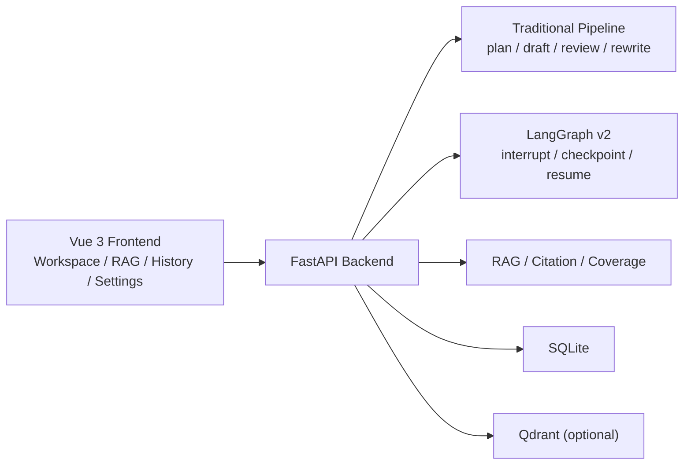

中文 | [English](./README_EN.md)

# Intelligent Writing Assistant

一个面向文档写作场景的智能写作助手，使用 Vue 3 + FastAPI 构建完整前后端工程，围绕 `plan -> research -> draft -> review -> rewrite -> citations` 提供传统写作 pipeline，并在不破坏旧链路的前提下，引入支持 multi-HITL、checkpoint、interrupt / resume 的 LangGraph v2 full-stage graph。

**Tech Stack**：Vue 3 + TypeScript + Vite / FastAPI / Hello-Agents / LangGraph v2 / SQLite / Qdrant（optional）

## ✨ 项目亮点

- **面向写作流程，而不是开放式聊天**：核心目标是把文档写作拆成可控的规划、起草、审校、改写和引用补全流程。
- **传统链路与演进链路并存**：旧 `/api/pipeline` 与 `/api/pipeline/stream` 保留，`/api/pipeline/v2*` 作为 LangGraph v2 演进路径独立落地。
- **LangGraph v2 已经进入 full-stage graph**：v2 路径支持 `outline_review`、`draft_review`、`review_confirmation` 三个 interrupt 点，以及 checkpoint / resume 与阶段边界恢复。
- **写作增强能力较完整**：支持 RAG 检索增强、citation / coverage、版本历史、会话记忆、流式输出和多种生成模式。
- **前后端工程闭环完整**：前端提供工作台、RAG 素材中心、历史版本、设置与 checkpoint 管理，后端提供 FastAPI API、服务编排与持久化。

## 🧭 系统能力总览

| 能力 | 当前状态 | 说明 |
| --- | --- | --- |
| 分步写作 API | 已支持 | `plan / draft / review / rewrite` |
| 传统一键 pipeline | 已支持 | `/api/pipeline`、`/api/pipeline/stream` |
| LangGraph v2 graph 路径 | 已支持 | `/api/pipeline/v2*` |
| Human-in-the-loop | 已支持 | `outline_review`、`draft_review`、`review_confirmation` |
| Checkpoint / resume | 已支持 | SQLite-backed checkpoint + best-effort stage resume |
| 流式体验 | 已支持 | 分步写作、旧 pipeline、v2 pipeline 均支持 SSE |
| RAG 文档上传与检索 | 已支持 | TXT / PDF / DOCX / MD 上传、搜索、文档库 |
| Citation / coverage | 已支持 | 引用补全、覆盖率统计、语义 / 词面明细 |
| 会话记忆 | 已支持 | `session / global` 模式与前端重置入口 |
| 版本历史 | 已支持 | 历史稿件、详情、diff、删除 |
| 检索评测 | 已支持 | Recall / Precision / HitRate / MRR / nDCG |

## 🏗️ 架构设计

### 前端

- `frontend/src/views/Workspace.vue`：主工作台，承载分步写作、旧 pipeline、LangGraph v2 Demo、模式切换与导出。
- `frontend/src/views/RagCenter.vue`：RAG 素材中心，包含文档上传、搜索、文档库与检索评测。
- `frontend/src/views/History.vue`：版本历史与 diff 对比。
- `frontend/src/views/Settings.vue`：健康检查、API Base 切换、checkpoint 查看与清理。

### 后端

- 后端使用 FastAPI 暴露写作、pipeline、LangGraph v2、RAG、citation、version、settings 等接口。
- 服务层负责规划、起草、审校、改写、检索、引用后处理与持久化。
- LangGraph v2 路径负责 interrupt / checkpoint / resume 的工作流编排。

更细的后端接口、配置、评测结果、checkpoint 说明见 [backend/README.md](./backend/README.md)。



## 🔄 核心工作流

### 传统主链路

适合快速体验完整写作闭环：

```text
topic/input
  -> plan
  -> research notes
  -> draft
  -> review
  -> rewrite
  -> citations / coverage / version save
```

特点：

- 路径稳定，支持同步与流式两种调用方式。
- 适合快速从主题走到终稿。
- 不包含 graph interrupt / resume。

### LangGraph v2 演进链路

适合展示多阶段人工确认与 checkpoint 恢复：

```mermaid
flowchart LR
    A["POST /api/pipeline/v2"] --> B["plan"]
    B --> C["interrupt: outline_review"]
    C --> D["resume"]
    D --> E["research"]
    E --> F["draft"]
    F --> G["interrupt: draft_review"]
    G --> H["resume"]
    H --> I["review"]
    I --> J["interrupt: review_confirmation"]
    J --> K["resume"]
    K --> L["rewrite?"]
    L --> M["post_process"]
    M --> N["completed"]
```



特点：

- v2 已经在 `/api/pipeline/v2*` 路径内形成 full-stage graph。
- review 阶段使用结构化 decision，支持 `review_text / needs_rewrite / reason / score`。
- stream 路径按阶段输出 SSE，并在 interrupt 点停止，等待下一次 resume。

## 📌 当前边界

当前实现已经覆盖主要写作链路，但边界需要明确：

- **不是多实例 durable workflow 平台**：checkpoint 当前依赖 SQLite，更适合单实例或演示环境。
- **best-effort resume 只支持阶段边界**：不承诺从任意中间 token 或内部 task 精确恢复。
- **旧主链路仍然存在**：当前是传统 pipeline 与 LangGraph v2 并行，而不是完全切换。
- **v2 stream 仍是阶段级 streaming**：不是 token-level 的 whole-graph streaming runtime。
- **review decision 存在 fallback**：结构化解析失败时会回退到 heuristic 判断，而不是严格 schema-only 终止。

## 📁 项目目录结构

```text
Intelligent-writing-assistant/
├─ backend/
│  ├─ app/
│  │  ├─ agents/
│  │  ├─ api/
│  │  ├─ models/
│  │  ├─ services/
│  │  └─ utils/
│  ├─ data/
│  ├─ evals/
│  ├─ scripts/
│  ├─ tests/
│  ├─ README.md
│  ├─ .env.example
│  ├─ main.py
│  └─ requirements.txt
├─ frontend/
│  ├─ src/
│  │  ├─ components/
│  │  ├─ router/
│  │  ├─ services/
│  │  ├─ store/
│  │  ├─ types/
│  │  └─ views/
│  └─ package.json
└─ README.md
```

## 🚀 本地运行

### 1. 启动后端

```bash
cd backend
python -m venv .venv
.venv\Scripts\activate
pip install -r requirements.txt
copy .env.example .env
python main.py
```

macOS / Linux：

```bash
cd backend
python -m venv .venv
source .venv/bin/activate
pip install -r requirements.txt
cp .env.example .env
python main.py
```

后端默认地址：

- `http://localhost:8000`
- Swagger: `http://localhost:8000/docs`

### 2. 启动前端

```bash
cd frontend
npm install
npm run dev
```

前端默认地址：

- `http://localhost:5173`

默认 API Base：

- `http://localhost:8000`

更细的后端环境变量、API 清单、评测脚本、LangGraph v2 checkpoint 与恢复说明见 [backend/README.md](./backend/README.md)。

## 🎬 使用方式

### 方式 1：体验传统写作闭环

1. 打开 `Workspace`
2. 输入主题、读者、风格、长度与审校标准
3. 执行 `一键 Pipeline`
4. 查看 outline、draft、review、revised、citations 与 coverage

### 方式 2：体验 LangGraph v2

1. 在 `Workspace` 中进入 `LangGraph v2 Demo`
2. 第一次 interrupt 后修订 outline
3. 第二次 interrupt 后修订 draft
4. 第三次 interrupt 查看 review confirmation 并继续
5. 在 `Settings` 页面查看与清理 checkpoint

### 方式 3：体验 RAG + citation

1. 在 `RagCenter` 上传 TXT / PDF / DOCX / MD
2. 回到 `Workspace` 切换 `rag_only / hybrid / creative`
3. 对比生成结果中的引用、`[推断]` 标注和 coverage 表现
4. 在 `History` 中查看版本差异

## 📚 更多文档

- [backend/README.md](./backend/README.md)：后端接口、LangGraph v2、配置、评测与运维说明
- [LANGGRAPH_MIGRATION_ANALYSIS.md](./LANGGRAPH_MIGRATION_ANALYSIS.md)：LangGraph 演进分析材料

## 📄 License

当前仓库未发现单独的项目 `LICENSE` 文件。

## 🙏 致谢 / 依赖

- [Hello-Agents](https://github.com/jjyaoao/HelloAgents.git)
- [LangGraph](https://github.com/langchain-ai/langgraph)
- [FastAPI](https://fastapi.tiangolo.com/)
- [Vue 3](https://vuejs.org/)
- [Qdrant](https://qdrant.tech/)
