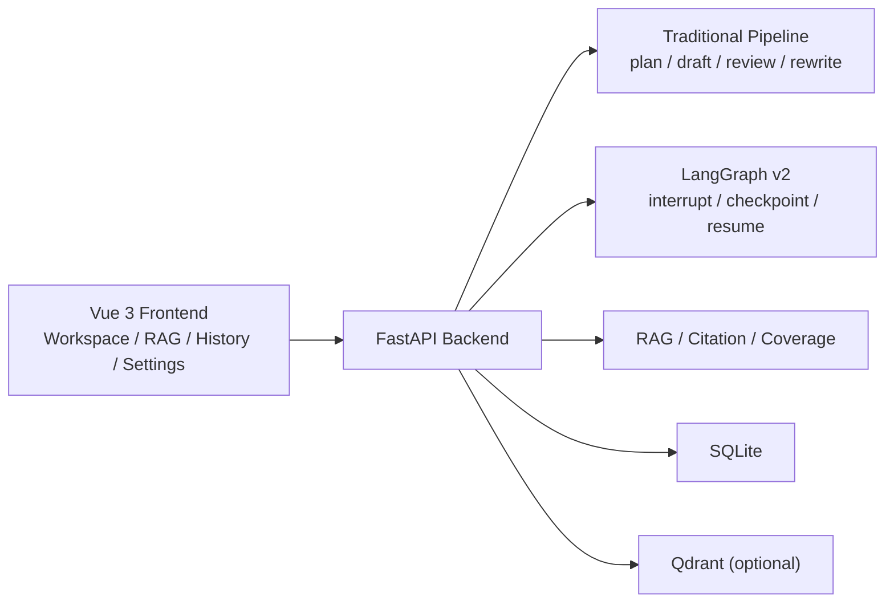

[中文](./README.md) | English

# Intelligent Writing Assistant

An agent-based writing assistant for document generation scenarios. The project provides a complete Vue 3 + FastAPI full-stack system built around a controllable writing flow:

`plan -> research -> draft -> review -> rewrite -> citations`

On top of the traditional pipeline, it also introduces a LangGraph v2 full-stage graph with multi-stage human-in-the-loop, checkpointing, and interrupt / resume, without breaking the original production-style path.

**Tech Stack**: Vue 3 + TypeScript + Vite / FastAPI / Hello-Agents / LangGraph v2 / SQLite / Qdrant (optional)

## Highlights

- **Built for writing workflows, not open-ended chat**: the core goal is to turn document writing into controllable planning, drafting, reviewing, rewriting, and citation-completion stages.
- **Traditional and evolutionary paths coexist**: the original `/api/pipeline` and `/api/pipeline/stream` remain intact, while `/api/pipeline/v2*` is implemented as an isolated LangGraph v2 path.
- **LangGraph v2 is already a full-stage graph**: the v2 path supports three interrupt points, `outline_review`, `draft_review`, and `review_confirmation`, plus checkpoint / resume and stage-boundary recovery.
- **Writing capabilities are relatively complete**: RAG retrieval, citation / coverage, version history, session memory, streaming output, and multiple generation modes are all included.
- **The project closes the loop end-to-end**: the frontend includes workspace, RAG center, history, settings, and checkpoint management; the backend includes FastAPI APIs, orchestration, and persistence.

## Capability Snapshot

| Capability | Status | Notes |
| --- | --- | --- |
| Step-by-step writing APIs | Supported | `plan / draft / review / rewrite` |
| Traditional full pipeline | Supported | `/api/pipeline`, `/api/pipeline/stream` |
| LangGraph v2 path | Supported | `/api/pipeline/v2*` |
| Human-in-the-loop | Supported | `outline_review`, `draft_review`, `review_confirmation` |
| Checkpoint / resume | Supported | SQLite-backed checkpoints + best-effort stage resume |
| Streaming UX | Supported | step APIs, legacy pipeline, and v2 all support SSE |
| RAG upload and retrieval | Supported | TXT / PDF / DOCX / MD upload, search, document library |
| Citation / coverage | Supported | citation completion, semantic and lexical coverage details |
| Session memory | Supported | `session / global` modes plus frontend reset entry |
| Version history | Supported | saved drafts, detail view, diff, delete |
| Retrieval evaluation | Supported | Recall / Precision / HitRate / MRR / nDCG |

## Architecture

### Frontend

- `frontend/src/views/Workspace.vue`: the main workspace for step-based writing, the legacy pipeline, the LangGraph v2 demo, generation-mode switching, and export.
- `frontend/src/views/RagCenter.vue`: the RAG center for document upload, search, document library, and retrieval evaluation.
- `frontend/src/views/History.vue`: version history and diff view.
- `frontend/src/views/Settings.vue`: health checks, API base switching, and checkpoint inspection / cleanup.

### Backend

- FastAPI exposes writing, pipeline, LangGraph v2, RAG, citation, version, and settings APIs.
- The service layer handles planning, drafting, reviewing, rewriting, retrieval, citation post-processing, and persistence.
- The LangGraph v2 path is responsible for interrupt / checkpoint / resume orchestration.

For backend interfaces, configuration, evaluation results, and checkpoint details, see [backend/README.md](./backend/README.md) or [backend/README_EN.md](./backend/README_EN.md).



## Core Workflows

### Traditional primary path

Suitable for a fast end-to-end writing loop:

```text
topic/input
  -> plan
  -> research notes
  -> draft
  -> review
  -> rewrite
  -> citations / coverage / version save
```

Characteristics:

- Stable path with both sync and streaming interfaces.
- Good for moving from topic to final draft quickly.
- No graph interrupt / resume.

### LangGraph v2 path

Suitable for demonstrating multi-stage human confirmation and checkpoint recovery:

```mermaid
flowchart LR
    A["POST /api/pipeline/v2"] --> B["plan"]
    B --> C["interrupt: outline_review"]
    C --> D["resume"]
    D --> E["research"]
    E --> F["draft"]
    F --> G["interrupt: draft_review"]
    G --> H["resume"]
    H --> I["review"]
    I --> J["interrupt: review_confirmation"]
    J --> K["resume"]
    K --> L["rewrite?"]
    L --> M["post_process"]
    M --> N["completed"]
```



Characteristics:

- The v2 path is already a full-stage graph under `/api/pipeline/v2*`.
- The review stage uses a structured decision with `review_text / needs_rewrite / reason / score`.
- The streaming path emits SSE events by stage and stops at each interrupt point until the next resume call.

## Current Boundaries

The implementation already covers the main writing flow, but its boundaries should be stated clearly:

- **Not a multi-instance durable workflow platform**: checkpointing currently relies on SQLite and is better suited for single-instance or demo environments.
- **Best-effort resume only works at stage boundaries**: it does not promise exact recovery from arbitrary internal tokens or task internals.
- **The legacy primary path still exists**: the current setup is traditional pipeline plus LangGraph v2, not a full cut-over.
- **v2 streaming is still stage-level streaming**: it is not token-level whole-graph streaming runtime.
- **Review decision still has a fallback path**: if structured parsing fails, it falls back to heuristic `needs_rewrite` instead of hard-failing on schema mismatch.

## Project Structure

```text
Intelligent-writing-assistant/
├─ backend/
│  ├─ app/
│  │  ├─ agents/
│  │  ├─ api/
│  │  ├─ models/
│  │  ├─ services/
│  │  └─ utils/
│  ├─ data/
│  ├─ evals/
│  ├─ scripts/
│  ├─ tests/
│  ├─ README.md
│  ├─ README_EN.md
│  ├─ .env.example
│  ├─ main.py
│  └─ requirements.txt
├─ frontend/
│  ├─ src/
│  │  ├─ components/
│  │  ├─ router/
│  │  ├─ services/
│  │  ├─ store/
│  │  ├─ types/
│  │  └─ views/
│  └─ package.json
└─ README.md
```

## Local Run

### 1. Start the backend

```bash
cd backend
python -m venv .venv
.venv\Scripts\activate
pip install -r requirements.txt
copy .env.example .env
python main.py
```

macOS / Linux:

```bash
cd backend
python -m venv .venv
source .venv/bin/activate
pip install -r requirements.txt
cp .env.example .env
python main.py
```

Default backend address:

- `http://localhost:8000`
- Swagger: `http://localhost:8000/docs`

### 2. Start the frontend

```bash
cd frontend
npm install
npm run dev
```

Default frontend address:

- `http://localhost:5173`

Default API base:

- `http://localhost:8000`

For detailed backend env vars, API lists, evaluation scripts, and LangGraph v2 checkpoint / resume behavior, see [backend/README_EN.md](./backend/README_EN.md).

## How to Use

### Option 1: Use the traditional writing flow

1. Open `Workspace`
2. Enter topic, audience, style, target length, and review criteria
3. Run `一键 Pipeline`
4. Inspect outline, draft, review, revised text, citations, and coverage

### Option 2: Use LangGraph v2

1. Open `LangGraph v2 Demo` in `Workspace`
2. Edit the outline after the first interrupt
3. Edit the draft after the second interrupt
4. Review the read-only review confirmation after the third interrupt
5. Use `Settings` to inspect or clean checkpoints

### Option 3: Use RAG + citation flow

1. Upload TXT / PDF / DOCX / MD files in `RagCenter`
2. Switch between `rag_only / hybrid / creative` in `Workspace`
3. Compare citations, `[推断]` markers, and coverage results
4. Open `History` to inspect version diffs

## More Documents

- [backend/README.md](./backend/README.md): backend APIs, LangGraph v2, configuration, evaluation, and ops details
- [backend/README_EN.md](./backend/README_EN.md): English backend documentation
- [LANGGRAPH_MIGRATION_ANALYSIS.md](./LANGGRAPH_MIGRATION_ANALYSIS.md): LangGraph migration analysis material

## License

No dedicated project `LICENSE` file is currently present in the repository.

## Acknowledgements / Dependencies

- [Hello-Agents](https://github.com/jjyaoao/HelloAgents.git)
- [LangGraph](https://github.com/langchain-ai/langgraph)
- [FastAPI](https://fastapi.tiangolo.com/)
- [Vue 3](https://vuejs.org/)
- [Qdrant](https://qdrant.tech/)
