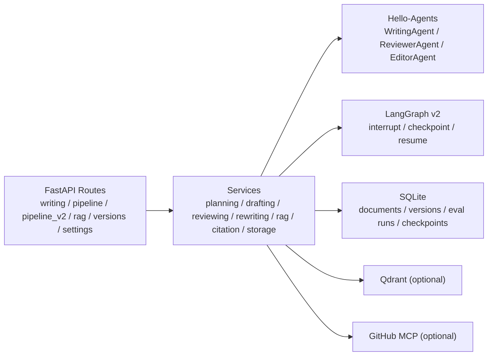

# Writing Assistant Backend

基于 FastAPI 的写作后端，负责分步写作、一键 pipeline、LangGraph v2 工作流、RAG 检索、引用补全、版本持久化与离线检索评测。

## 核心能力

- 写作流程：`plan -> research -> draft -> review -> rewrite -> citations`
- 分步接口与一键 pipeline：同步 / SSE 两条路径都可用
- LangGraph v2：`outline_review`、`draft_review`、`review_confirmation` 三个 interrupt 点，支持 checkpoint / resume
- RAG：文档上传、搜索、文档库、动态 `top_k`、rerank、HyDE、bilingual rewrite
- 生成模式：`rag_only / hybrid / creative`
- 引用与覆盖率：citation 补全、语义 / 词面 coverage 明细
- 会话记忆：`session / global` 两种模式，支持前端主动清空
- 离线评测：Recall / Precision / HitRate / MRR / nDCG，评测结果可持久化
- 可选扩展：Qdrant hybrid retrieval、GitHub MCP

## 后端结构



### 目录结构

```text
backend/
├─ app/
│  ├─ agents/        # Writing / Reviewer / Editor
│  ├─ api/
│  │  ├─ main.py
│  │  └─ routes/     # writing / pipeline / pipeline_v2 / rag / versions / settings / mcp_github
│  ├─ models/
│  ├─ services/      # pipeline / rag / citation / retrieval_eval / storage / langgraph_v2
│  └─ utils/
├─ data/             # SQLite 数据与 checkpoint 文件
├─ evals/            # baseline 报告与评测集
├─ scripts/          # 评测脚本
├─ tests/
├─ .env.example
├─ main.py
└─ requirements.txt
```

## LangGraph v2 后端链路

`/api/pipeline/v2*` 是在旧 pipeline 之外演进出来的一条独立路径，用来承载 graph orchestration、interrupt / resume 与 checkpoint 管理。旧 `/api/pipeline`、`/api/pipeline/stream` 仍然保留。


### 当前已落地的 v2 能力

- `outline_review`：outline 生成后中断，等待人工确认或修改
- `draft_review`：draft 生成后中断，允许人工编辑草稿
- `review_confirmation`：review 完成后中断，展示结构化 decision，等待确认继续
- review decision 使用结构化协议：

```json
{
  "review_text": "string",
  "needs_rewrite": true,
  "reason": "string",
  "score": 0.82
}
```

- best-effort stage resume 当前覆盖：
  - `outline_accepted`
  - `research_done`
  - `draft_done`
  - `review_done`
  - `rewrite_done`
  - `completed`
- `rewrite_done` 表示 rewrite 已完成，可从 `post_process` 继续
- v2 同时提供同步与流式接口：
  - `/api/pipeline/v2`
  - `/api/pipeline/v2/resume`
  - `/api/pipeline/v2/stream`
  - `/api/pipeline/v2/resume/stream`

### v2 的真实边界

- 当前不是多实例 durable workflow 平台
- `resume` 是阶段边界 best-effort resume，不是任意内部节点精确恢复
- stream 是阶段级 SSE，不是 token-level whole-graph streaming runtime
- review decision 结构化解析失败时，会 fallback 到 heuristic `needs_rewrite`

## 评测与定量结果

### 1. 后端内置的离线检索评测

后端提供 `POST /api/rag/evaluate`，支持在给定标注集上计算：

- Recall@K
- Precision@K
- HitRate@K
- MRR@K
- nDCG@K

`tests/test_retrieval_eval_service.py` 已验证一组确定性样例：

| 样例设置 | Recall | Precision | HitRate | MRR | nDCG |
| --- | --- | --- | --- | --- | --- |
| `K=1` | `0.25` | `0.50` | `0.50` | `0.50` | 已计算 |
| `K=3` | `1.00` | `0.50` | `1.00` | `0.75` | 已计算 |

这部分能力不仅暴露为 API，也会把评测结果持久化到 SQLite，方便后续比较不同配置或 baseline。

### 2. 仓库内保留的一次 RAG 失败样本

根目录 `RAG_EVALUATION_REPORT.md` 记录了一次真实评估样本：

| 指标 | 数值 |
| --- | --- |
| 找到文档数 | `7` |
| 查询词数 | `145` |
| Best Recall | `0.434` |
| Avg Recall | `0.298` |
| 任务成功率 | `33.3%`（`2/6`） |

这份记录的价值在于它保留了失败原因，而不是只保留成功样例。后端的拒答阈值、Top-K、rerank、coverage 设计都可以围绕这类结果继续收敛。

### 3. baseline 报告快照

`backend/evals/baseline_report.md` 中保留了一份基于 `retrieval_eval_small_hard.json` 的 baseline 对比结果，主表如下：

| Baseline | Recall@5 | Precision@5 | HitRate@5 | MRR@5 | nDCG@5 |
| --- | ---: | ---: | ---: | ---: | ---: |
| dense_only | 95.8% | 21.7% | 100.0% | 0.806 | 0.845 |
| dense_rerank | 98.3% | 22.7% | 100.0% | 0.861 | 0.888 |
| dense_hyde_rerank | 97.5% | 22.3% | 100.0% | 0.875 | 0.894 |
| dense_rerank_bilingual | 96.7% | 22.0% | 100.0% | 0.839 | 0.867 |
| dense_hyde_rerank_bilingual | 96.7% | 22.0% | 100.0% | 0.856 | 0.879 |

同一份报告还记录了 5 次重复运行的均值 ± 标准差，以及 Agent 行为回归小套件结果：

- Repeats per baseline: `5`
- Agent 行为回归小套件：`17/17` 通过

需要注意：

- 上述 baseline 数字是仓库内保留的实验快照，不应被当作所有语料和所有业务场景下的通用线上指标。
- 如果你改动了检索策略、rerank、HyDE 或 bilingual rewrite，建议重新运行评测脚本生成新的报告。

## 快速启动

### Windows

```bash
cd backend
python -m venv .venv
.venv\Scripts\activate
pip install -r requirements.txt
copy .env.example .env
python main.py
```

### macOS / Linux

```bash
cd backend
python -m venv .venv
source .venv/bin/activate
pip install -r requirements.txt
cp .env.example .env
python main.py
```

默认服务地址：

- `http://localhost:8000`
- Swagger: `http://localhost:8000/docs`
- ReDoc: `http://localhost:8000/redoc`
- Health: `http://localhost:8000/healthz`

`backend/main.py` 默认以 `0.0.0.0:8000` 启动，`UVICORN_RELOAD=true` 时可开启 reload。

## 最小配置

完整变量见 `.env.example`。如果只是先跑通后端，最小配置如下：

```env
LLM_PROVIDER=openai
LLM_MODEL=YOUR_MODEL_NAME
LLM_API_KEY=YOUR_API_KEY
LLM_API_BASE=YOUR_API_BASE

RETRIEVAL_MODE=sqlite_only
CONVERSATION_MEMORY_MODE=session
RAG_GENERATION_MODE=rag_only
MCP_GITHUB_ENABLED=false
```

### 可选增强配置

Qdrant：

```env
QDRANT_URL=YOUR_QDRANT_URL
QDRANT_API_KEY=YOUR_QDRANT_KEY
QDRANT_COLLECTION=hello_agents_vectors
QDRANT_EMBED_DIM=1024
QDRANT_DISTANCE=cosine
```

LangGraph v2 checkpoint：

```env
LANGGRAPH_V2_CHECKPOINT_DB=data/langgraph_v2_checkpoints.sqlite
```

GitHub MCP：

```env
MCP_GITHUB_ENABLED=true
GITHUB_PERSONAL_ACCESS_TOKEN=YOUR_GITHUB_TOKEN
MCP_GITHUB_TOOL_SCOPE=search
MCP_GITHUB_MAX_TOOLS=5
```

## API 概览

所有接口统一以 `/api` 为前缀。

### 写作分步

- `POST /api/plan`
- `POST /api/draft`
- `POST /api/draft/stream`
- `POST /api/review`
- `POST /api/review/stream`
- `POST /api/rewrite`
- `POST /api/rewrite/stream`

### 一键流程

- `POST /api/pipeline`
- `POST /api/pipeline/stream`
- `POST /api/pipeline/v2`
- `POST /api/pipeline/v2/resume`
- `POST /api/pipeline/v2/stream`
- `POST /api/pipeline/v2/resume/stream`

### RAG / Citation / Evaluation

- `POST /api/rag/upload`
- `POST /api/rag/upload-file`
- `POST /api/rag/search`
- `GET /api/rag/documents`
- `DELETE /api/rag/documents/{doc_id}`
- `POST /api/rag/evaluate`
- `GET /api/rag/evaluations`
- `GET /api/rag/evaluations/{run_id}`
- `DELETE /api/rag/evaluations/{run_id}`
- `POST /api/citations`

### 版本与设置

- `GET /api/versions`
- `GET /api/versions/{version_id}`
- `GET /api/versions/{version_id}/diff`
- `DELETE /api/versions/{version_id}`
- `GET /api/settings/generation-mode`
- `POST /api/settings/generation-mode`
- `POST /api/settings/session-memory/clear`

### MCP

- `GET /api/mcp/github/tools`
- `POST /api/mcp/github/call`

## checkpoint、存储与运维

### SQLite 数据

后端默认使用 SQLite 持久化：

- 文档库与版本历史
- 检索评测结果
- LangGraph v2 checkpoint

默认数据目录：

- `backend/data/`

### LangGraph v2 checkpoint

- 环境变量：`LANGGRAPH_V2_CHECKPOINT_DB`
- 默认文件：`data/langgraph_v2_checkpoints.sqlite`
- 只要 checkpoint 文件仍在，服务重启后仍可以继续使用同一个 `thread_id` resume

### 运行注意项

- `session` 记忆模式下，请保持同一个 `session_id`
- `hybrid` 模式下，如果 Qdrant 不可用，会降级到 SQLite 检索
- SSE 依赖 `text/event-stream`，反向代理需要允许长连接
- `review_confirmation` 当前是只读确认，不提供 review 文本编辑

## 评测脚本

后端内置 baseline 对比脚本：

- `scripts/run_retrieval_baselines.py`

默认输入 / 输出：

- Eval set：`evals/retrieval_eval_small.json`
- Report：`evals/baseline_report.md`
- Detail report：`evals/baseline_report_details.md`

### 运行方式

先启动后端，再运行：

```bash
cd backend
python scripts/run_retrieval_baselines.py
```

加入 bilingual baseline：

```bash
python scripts/run_retrieval_baselines.py --include-bilingual-baselines
```

使用 harder eval set 并重复运行 5 次：

```bash
python scripts/run_retrieval_baselines.py --eval evals/retrieval_eval_small_hard.json --include-bilingual-baselines --repeats 5 --timeout 600
```

脚本会通过 `/api/rag/evaluate` 调用后端，并生成主报告与详情报告。

## 测试

后端已经包含与 v2、RAG 相关的测试文件，例如：

- `tests/test_reviewing_service.py`
- `tests/test_pipeline_v2_api.py`
- `tests/test_retrieval_eval_service.py`
- `tests/test_rag_evaluate_api.py`

如果你改动了 review decision、resume 语义、RAG 评测逻辑或 v2 接口，建议优先补这些测试。
