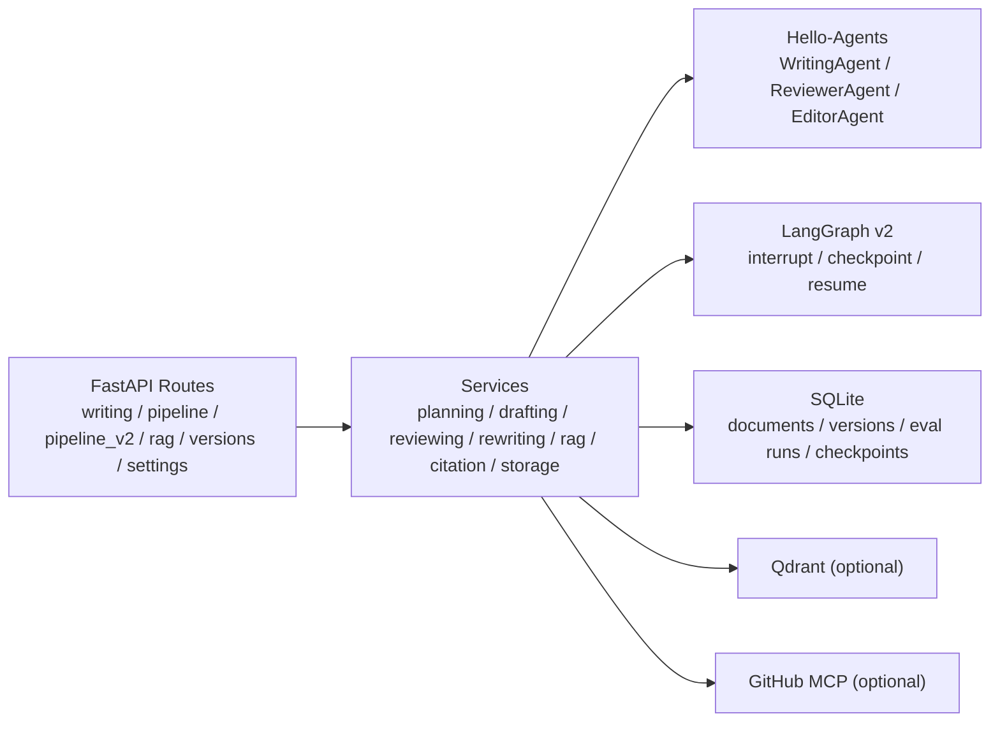

[中文](./README.md) | English

# Writing Assistant Backend

The FastAPI backend for the writing assistant. It is responsible for step-based writing APIs, the legacy full pipeline, LangGraph v2 workflows, RAG retrieval, citation completion, version persistence, and offline retrieval evaluation.

## Core Capabilities

- Writing flow: `plan -> research -> draft -> review -> rewrite -> citations`
- Step APIs and full pipeline: both sync and SSE paths are available
- LangGraph v2: three interrupt points, `outline_review`, `draft_review`, and `review_confirmation`, with checkpoint / resume
- RAG: document upload, search, document library, dynamic `top_k`, rerank, HyDE, and bilingual rewrite
- Generation modes: `rag_only / hybrid / creative`
- Citation and coverage: citation completion plus semantic and lexical coverage details
- Session memory: `session / global` modes with a frontend reset entry
- Offline evaluation: Recall / Precision / HitRate / MRR / nDCG with persisted evaluation runs
- Optional extensions: Qdrant hybrid retrieval and GitHub MCP

## Backend Structure



### Directory Layout

```text
backend/
├─ app/
│  ├─ agents/        # Writing / Reviewer / Editor
│  ├─ api/
│  │  ├─ main.py
│  │  └─ routes/     # writing / pipeline / pipeline_v2 / rag / versions / settings / mcp_github
│  ├─ models/
│  ├─ services/      # pipeline / rag / citation / retrieval_eval / storage / langgraph_v2
│  └─ utils/
├─ data/             # SQLite data and checkpoint files
├─ evals/            # baseline reports and eval sets
├─ scripts/          # evaluation scripts
├─ tests/
├─ .env.example
├─ main.py
└─ requirements.txt
```

## LangGraph v2 Backend Flow

`/api/pipeline/v2*` is an independent path evolved alongside the legacy pipeline. It carries graph orchestration, interrupt / resume, and checkpoint management. The original `/api/pipeline` and `/api/pipeline/stream` remain available.


### What v2 currently supports

- `outline_review`: interrupt after outline generation, waiting for human confirmation or modification
- `draft_review`: interrupt after draft generation, allowing human draft edits
- `review_confirmation`: interrupt after review completion, exposing a structured decision and waiting for confirmation
- The review decision uses a structured protocol:

```json
{
  "review_text": "string",
  "needs_rewrite": true,
  "reason": "string",
  "score": 0.82
}
```

- Best-effort stage resume currently covers:
  - `outline_accepted`
  - `research_done`
  - `draft_done`
  - `review_done`
  - `rewrite_done`
  - `completed`
- `rewrite_done` means rewrite already finished and the flow can continue from `post_process`
- v2 exposes both sync and streaming interfaces:
  - `/api/pipeline/v2`
  - `/api/pipeline/v2/resume`
  - `/api/pipeline/v2/stream`
  - `/api/pipeline/v2/resume/stream`

### Real boundaries of v2

- It is not a multi-instance durable workflow platform
- `resume` is stage-boundary best-effort resume, not exact recovery from arbitrary internal nodes
- Streaming is stage-level SSE, not token-level whole-graph streaming runtime
- If structured review parsing fails, it falls back to heuristic `needs_rewrite`

## Evaluation and Quantitative Results

### 1. Built-in offline retrieval evaluation

The backend exposes `POST /api/rag/evaluate` and computes:

- Recall@K
- Precision@K
- HitRate@K
- MRR@K
- nDCG@K

`tests/test_retrieval_eval_service.py` already validates one deterministic example set:

| Example setup | Recall | Precision | HitRate | MRR | nDCG |
| --- | --- | --- | --- | --- | --- |
| `K=1` | `0.25` | `0.50` | `0.50` | `0.50` | computed |
| `K=3` | `1.00` | `0.50` | `1.00` | `0.75` | computed |

This capability is available as an API and is also persisted to SQLite so that different retrieval configurations or baselines can be compared later.

### 2. Preserved RAG failure sample in the repository

The root-level `RAG_EVALUATION_REPORT.md` preserves one real evaluation sample:

| Metric | Value |
| --- | --- |
| Documents found | `7` |
| Query terms | `145` |
| Best Recall | `0.434` |
| Avg Recall | `0.298` |
| Task success rate | `33.3%` (`2/6`) |

This record is useful because it keeps a failure case instead of only successful demos. Refusal thresholds, Top-K, rerank, and coverage strategies can all be reasoned about against this kind of sample.

### 3. Baseline report snapshot

`backend/evals/baseline_report.md` preserves a baseline comparison run on `retrieval_eval_small_hard.json`. The main table is:

| Baseline | Recall@5 | Precision@5 | HitRate@5 | MRR@5 | nDCG@5 |
| --- | ---: | ---: | ---: | ---: | ---: |
| dense_only | 95.8% | 21.7% | 100.0% | 0.806 | 0.845 |
| dense_rerank | 98.3% | 22.7% | 100.0% | 0.861 | 0.888 |
| dense_hyde_rerank | 97.5% | 22.3% | 100.0% | 0.875 | 0.894 |
| dense_rerank_bilingual | 96.7% | 22.0% | 100.0% | 0.839 | 0.867 |
| dense_hyde_rerank_bilingual | 96.7% | 22.0% | 100.0% | 0.856 | 0.879 |

The same report also records repeated-run mean and standard deviation, as well as the agent behavior regression suite:

- Repeats per baseline: `5`
- Agent behavior regression suite: `17/17` passed

Important boundary:

- These baseline numbers are repository snapshots, not universal online production metrics for all corpora and tasks.
- If retrieval strategy, rerank, HyDE, or bilingual rewrite changes, the baseline script should be rerun to produce a new report.

## Quick Start

### Windows

```bash
cd backend
python -m venv .venv
.venv\Scripts\activate
pip install -r requirements.txt
copy .env.example .env
python main.py
```

### macOS / Linux

```bash
cd backend
python -m venv .venv
source .venv/bin/activate
pip install -r requirements.txt
cp .env.example .env
python main.py
```

Default service addresses:

- `http://localhost:8000`
- Swagger: `http://localhost:8000/docs`
- ReDoc: `http://localhost:8000/redoc`
- Health: `http://localhost:8000/healthz`

`backend/main.py` binds to `0.0.0.0:8000` by default. `UVICORN_RELOAD=true` enables reload mode.

## Minimal Configuration

See `.env.example` for the full variable list. For a minimal bootable setup:

```env
LLM_PROVIDER=openai
LLM_MODEL=YOUR_MODEL_NAME
LLM_API_KEY=YOUR_API_KEY
LLM_API_BASE=YOUR_API_BASE

RETRIEVAL_MODE=sqlite_only
CONVERSATION_MEMORY_MODE=session
RAG_GENERATION_MODE=rag_only
MCP_GITHUB_ENABLED=false
```

### Optional enhancements

Qdrant:

```env
QDRANT_URL=YOUR_QDRANT_URL
QDRANT_API_KEY=YOUR_QDRANT_KEY
QDRANT_COLLECTION=hello_agents_vectors
QDRANT_EMBED_DIM=1024
QDRANT_DISTANCE=cosine
```

LangGraph v2 checkpoint:

```env
LANGGRAPH_V2_CHECKPOINT_DB=data/langgraph_v2_checkpoints.sqlite
```

GitHub MCP:

```env
MCP_GITHUB_ENABLED=true
GITHUB_PERSONAL_ACCESS_TOKEN=YOUR_GITHUB_TOKEN
MCP_GITHUB_TOOL_SCOPE=search
MCP_GITHUB_MAX_TOOLS=5
```

## API Overview

All interfaces are under the `/api` prefix.

### Step-based writing

- `POST /api/plan`
- `POST /api/draft`
- `POST /api/draft/stream`
- `POST /api/review`
- `POST /api/review/stream`
- `POST /api/rewrite`
- `POST /api/rewrite/stream`

### Full pipeline

- `POST /api/pipeline`
- `POST /api/pipeline/stream`
- `POST /api/pipeline/v2`
- `POST /api/pipeline/v2/resume`
- `POST /api/pipeline/v2/stream`
- `POST /api/pipeline/v2/resume/stream`

### RAG / Citation / Evaluation

- `POST /api/rag/upload`
- `POST /api/rag/upload-file`
- `POST /api/rag/search`
- `GET /api/rag/documents`
- `DELETE /api/rag/documents/{doc_id}`
- `POST /api/rag/evaluate`
- `GET /api/rag/evaluations`
- `GET /api/rag/evaluations/{run_id}`
- `DELETE /api/rag/evaluations/{run_id}`
- `POST /api/citations`

### Versions and settings

- `GET /api/versions`
- `GET /api/versions/{version_id}`
- `GET /api/versions/{version_id}/diff`
- `DELETE /api/versions/{version_id}`
- `GET /api/settings/generation-mode`
- `POST /api/settings/generation-mode`
- `POST /api/settings/session-memory/clear`

### MCP

- `GET /api/mcp/github/tools`
- `POST /api/mcp/github/call`

## Checkpoints, Storage, and Operations

### SQLite data

The backend uses SQLite by default for:

- document library and version history
- retrieval evaluation results
- LangGraph v2 checkpoints

Default data directory:

- `backend/data/`

### LangGraph v2 checkpoints

- Environment variable: `LANGGRAPH_V2_CHECKPOINT_DB`
- Default file: `data/langgraph_v2_checkpoints.sqlite`
- As long as the checkpoint file exists, the same `thread_id` can be resumed after a service restart

### Runtime notes

- Under `session` memory mode, keep the same `session_id`
- Under `hybrid` retrieval mode, if Qdrant is unavailable the system falls back to SQLite retrieval
- SSE depends on `text/event-stream`; reverse proxies must allow long-lived connections
- `review_confirmation` is currently a read-only confirmation step, not an editable review panel

## Evaluation Scripts

The backend includes a baseline comparison script:

- `scripts/run_retrieval_baselines.py`

Default input / output:

- Eval set: `evals/retrieval_eval_small.json`
- Report: `evals/baseline_report.md`
- Detail report: `evals/baseline_report_details.md`

### How to run

Start the backend first, then run:

```bash
cd backend
python scripts/run_retrieval_baselines.py
```

Include bilingual baselines:

```bash
python scripts/run_retrieval_baselines.py --include-bilingual-baselines
```

Use the harder eval set and repeat five times:

```bash
python scripts/run_retrieval_baselines.py --eval evals/retrieval_eval_small_hard.json --include-bilingual-baselines --repeats 5 --timeout 600
```

The script calls `/api/rag/evaluate` and generates both the main report and the detailed report.

## Tests

The backend already includes tests covering v2 and RAG-related paths, for example:

- `tests/test_reviewing_service.py`
- `tests/test_pipeline_v2_api.py`
- `tests/test_retrieval_eval_service.py`
- `tests/test_rag_evaluate_api.py`

If review decision behavior, resume semantics, retrieval evaluation logic, or v2 interfaces are changed, these are the first tests worth updating and rerunning.
